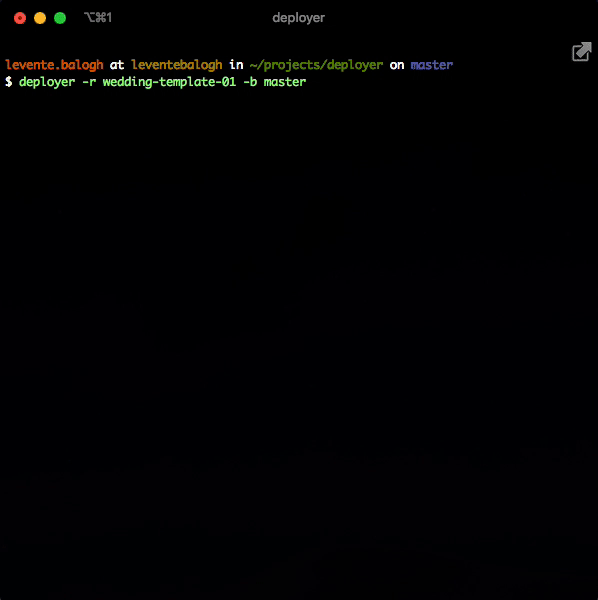

# Deployer

A simple service for deploying docker containers easily.




## Install
```bash
$ npm i -g @devcrush/deployer
```

**Other dependencies**:
- Ansible (client) - [Installation Guide](https://docs.ansible.com/ansible/latest/installation_guide/intro_installation.html)
- Docker (server) - [Installation Guide](https://docs.docker.com/install/linux/docker-ce/ubuntu/)


## Usage
```bash
# You can always display the usage information by "$ deployer --help"
Options:
  --version         Show version number                                [boolean]
  --repository, -r  Name of your repository on Github. (e.g. "react") [required]
  --branch, -b      Name of the branch you would like to deploy. (e.g. "master")
                                                                      [required]
  --verbose, -v     Use to display more detailed logging
  --help            Show help                                          [boolean]

Examples:
  deployer -r my-project -b master  Deploys the master branch from "my-project"
                                    to the target servers. "my-project" will be
                                    transformed to "git@github.com:<username>/my-project"
                                    under the hood, but in order to make it work you
                                    have to create a ~/.deployer.yml config
                                    file. The --repository option also accepts
                                    an absolute URL.
```

## Verbose mode
You can log out all the configuration parameters by using the `--verbose` flag.

## User configuration
The user configuration should be located at `~/.deployer.yml`:
```yaml
# The github username that you would like to use to resolve repository names by default.
githubUsername: leventebalogh,

# The name of the folder to check out temporary code into 
checkoutFolderName: '__deployer__',

# Set it TRUE to use SSH to connect to Github
githubUseSSH: true

# (Optional)
# Specify a private SSH key to use for authentication
# Defaults to "~/.ssh/id_rsa"
keyFile: /Users/levente.balogh/.ssh/personal_rsa

# (Optional)
# Specify the user to use for the SSH authentication
# Defaults to "www"
user: foo
```

## Repository configuration
The repository configuration should be located at the root of of your repository.
The name of the file should be `.deployer.yml`.

```yaml
# (Required)
# The list of hosts where your project should be deployed to.
targetHosts:
    - worker-1.leventebalogh.com
    - worker-2.leventebalogh.com

# (Optional)
# The name of the docker container that will be started from the image.
# Deafults back to the name of the repository.
containerName: foo

# (Optional)
# The list of networks which should be attached to the container.
networks:
    - nginx
    - db

# (Optional)
# The list of ports you would like to expose from the container. 
ports:
    - 8080:8080
    - 8081:8081

```

## How does it work?
```
    $> ./bin/deploy "<repo-name>" "<branch-name>"
                     |
                     v
          +----------------------+   Not found
          | Check out repo and   +-------------->  ERROR
          | branch               |
         +----------+-----------+
                     |
          +----------v-----------+   No file
          | Check if deploy.yml  +-------------->  ERROR
          | exists in project    |
          +----------+-----------+
                     |
          +----------v-----------+
          | Read configuration   |
          | from deploy.yml      |
          +----------+-----------+
                     |
    Docker           |
    +----------------v-----------------+
    | 1. Checkout repo to target host  |
    | 2. Build docker image            |
    | 3. Restart container from image  |
    +----------------------------------+
```
